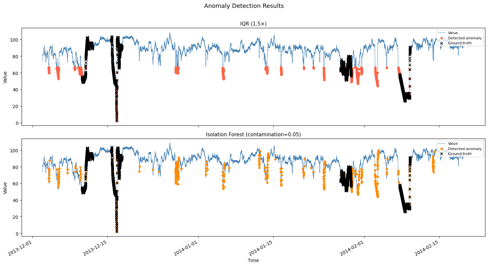

# SUBMIT.md

## 1. Dataset
- **File**: machine_temperature_system_failure.csv (NAB realKnownCause)
- **Size**: 22,695 points, 5-minute intervals, 2013-12-02 → 2014-02-19

---

## 2. Anomaly Detection Plot

---

## 3. Comparison Table

| Metric       | Detector 1 — IQR (1.5×) | Detector 2 — Isolation Forest (cont=0.05) |
|--------------|--------------------------|-------------------------------------------|
| Precision    | 0.5801                   | 0.6264                                    |
| Recall       | 0.5877                   | 0.3135                                    |
| F1           | 0.5839                   | 0.4179                                    |
| False Alarms | 965                      | 424                                       |

---

## 4. Contamination Tuning Log (Isolation Forest)

| Round | Contamination | Precision | Recall | F1     |
|-------|---------------|-----------|--------|--------|
| 1     | 0.01          | 0.8546    | 0.0855 | 0.1555 |
| 2     | 0.02          | 0.8216    | 0.1645 | 0.2741 |
| 3     | 0.05          | 0.6264    | 0.3135 | 0.4179 |

**Observation**: Higher contamination → higher recall but lower precision.
contamination=0.05 gives best F1 (0.418) and was selected as final model.

---

## 5. Model Artifact
- File: `isolation_forest.joblib`
- Algorithm: Isolation Forest, n_estimators=200, contamination=0.05
- Features: value, rolling_mean, rolling_std, rolling_min, rolling_max,
            diff1, diff2, z_score, rolling_range, abs_diff1 (window=50)

---

## 6. Reflection

### Data Type
- **Non-Gaussian**: KDE deviates heavily from normal fit
- **Strongly negatively skewed**: skewness = −1.83, heavy left tail from failure events
- **No seasonality**: ACF decays smoothly with no repeating peaks
- **Non-stationary**: baseline mean drifts from ~79.8°C → ~93.2°C over 80 days

### Method Selection
- **Detector 1 — IQR**: Chosen because skewness = −1.83 makes Z-score unreliable
  (Z-score assumes symmetry). IQR is quartile-based, distribution-free, and
  naturally catches the catastrophic temperature drops (near 0°C) via the lower fence.
- **Detector 2 — Isolation Forest**: Chosen because it is distribution-free,
  operates on multi-feature space, and requires no stationarity assumption.

### Which Detector is Better?
**IQR wins on F1 (0.584 vs 0.418) and recall (0.588 vs 0.314).**
Isolation Forest wins on precision (0.626 vs 0.580) and false alarms (424 vs 965).

### Trade-offs
| Aspect | IQR | Isolation Forest |
|---|---|---|
| Interpretability | ✅ High — simple fence rule | ❌ Black box |
| Recall | ✅ 0.588 | ❌ 0.314 |
| False Alarms | ❌ 965 | ✅ 424 |
| Assumption-free | ✅ Yes | ✅ Yes |
| Tunable | ❌ Limited | ✅ contamination param |

### Production Choice
**IQR for alerting, Isolation Forest for investigation.**
In production, missing a real machine failure (low recall) is more costly than
a false alarm. IQR's recall of 0.588 makes it safer as a first-line alert.
Isolation Forest's higher precision (0.626) and fewer false alarms make it
better for a secondary investigation layer where analyst time is limited.
If forced to choose one: **IQR**, because in industrial anomaly detection
the cost of a missed failure (machine damage, safety risk) far outweighs
the cost of a false alarm (unnecessary inspection).