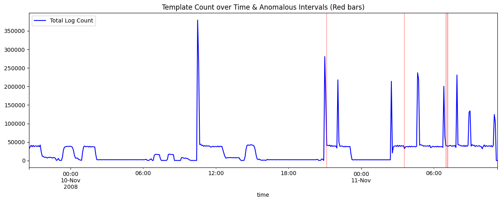

# Assignment Day 2: Log Parsing & Anomaly Detection

## 1. Screenshots

### 1.1 Template Count Time Series & Anomaly Highlights


> **Description:** Total log count per 5-minute window. Red vertical bars mark anomalous intervals detected by **Isolation Forest**.

---

## 2. Logs & Tuning Output

### 2.1 Drain3 Tuning (`drain_sim_th`)
- `sim_th = 0.3` → **63 templates**
- `sim_th = 0.5` → **55 templates** (chosen as best balance)
- `sim_th = 0.7` → (more templates, over-splitting)

**Best threshold: 0.5**

### 2.2 Top 10 Templates (HDFS)

| Template ID | Count     | Template |
|-------------|-----------|----------|
| 1           | 1,723,232 | `<*> <*> <*> INFO dfs.DataNode$DataXceiver: Receiving block...` |
| 5           | 1,719,741 | `<*> <*> <*> INFO dfs.FSNamesystem: BLOCK* NameSystem.addStoredBlock...` |
| 4           | 1,706,514 | `<*> <*> <*> INFO dfs.DataNode$PacketResponder: Received block...` |
| 17          | 1,402,047 | `<*> <*> <*> INFO dfs.FSDataset: Deleting block...` |
| 31          | 1,396,174 | `<*> <*> <*> INFO dfs.FSNamesystem: BLOCK* NameSystem.delete...` |
| 49          | 859,939   | `081111 <*> <*> INFO dfs.DataNode$PacketResponder...` |
| 36          | 680,085   | `081110 <*> <*> INFO dfs.DataNode$PacketResponder...` |
| 34          | 356,207   | `<*> <*> <*> WARN dfs.DataNode$DataXceiver: ...` |
| 38          | 351,415   | `081110 <*> <*> INFO dfs.DataNode$DataXceiver: Served block...` |
| 48          | 288,998   | `081111 <*> <*> INFO dfs.FSNamesystem: BLOCK* NameSystem.allocateBlock...` |

*(Full list exported to `results/top_templates.csv`)*

---

## 3. Phase 2: Anomaly Detection

- Used **5-minute windows** for template count time series.
- Applied **Isolation Forest** (`contamination=0.01`) for anomaly detection.

### 3.1 Spiking Templates in Anomalous Windows

The following templates were identified as significantly spiking compared to their normal-period average:

| Template ID | Spike Ratio | Notes |
|-------------|-------------|-------|
| 54 | **60,000×** | First appeared at `2008-11-11 07:06:40` — brand new template |
| 55 | **40,000×** | First appeared at `2008-11-11 07:10:32` — brand new template |
| 45 | **642.5×** | Extreme spike relative to baseline |
| 42 | **367.2×** | Extreme spike relative to baseline |
| 39 | **366.3×** | Extreme spike relative to baseline |

> Templates 54 and 55 are also **new templates** (first seen late in the log history), making them doubly suspicious — they represent behavior patterns never seen before.

### 3.2 First Appearance of Templates

**Earliest templates** (established at log start):

| Template ID | First Seen |
|-------------|------------|
| 1 | 2008-11-09 20:35:18 |
| 2 | 2008-11-09 20:35:18 |
| 3 | 2008-11-09 20:35:19 |
| 4 | 2008-11-09 20:35:19 |
| 5 | 2008-11-09 20:35:19 |

**Newest templates** (first appeared late — anomaly candidates):

| Template ID | First Seen |
|-------------|------------|
| 51 | 2008-11-11 03:32:55 |
| 52 | 2008-11-11 03:33:42 |
| 53 | 2008-11-11 04:39:36 |
| 54 | 2008-11-11 07:06:40 |
| 55 | 2008-11-11 07:10:32 |

### 3.3 Precision / Recall (HDFS Ground Truth)

Evaluated against the HDFS label file by mapping anomalous 5-minute windows → BlockIds.

```
              precision    recall  f1-score   support

     Anomaly       0.12      0.14      0.13     16838
      Normal       0.97      0.97      0.97    558223

    accuracy                           0.94    575061
   macro avg       0.55      0.55      0.55    575061
weighted avg       0.95      0.94      0.95    575061
```

**Analysis:**
- **Overall accuracy is high (94%)** — mainly because normal blocks dominate (558K vs 16K anomalies).
- **Anomaly precision/recall is low (0.12 / 0.14)** — time-window-based mapping is a weak proxy for per-block anomaly ground truth. Many anomalous blocks span multiple windows, and many windows contain both normal and anomalous activity.
- **This is expected** for a simple window-level Isolation Forest approach. Proper block-level sequence-based methods (e.g., DeepLog, LogBERT) achieve much higher recall on HDFS.

---

## 4. Phase 3: Template Clustering & Novel Log Detection

- Used **TF-IDF + Cosine Similarity + KMeans (5 clusters)** on templates.
- Injected strange log:  
  `'081109 204000 999 FATAL SYSTEM_CORE: Core meltdown detected in reactor 4! Temperature > 9000C'`
- **Result:** Drain3 successfully created a **new template** (ID 56) → **Anomaly detected correctly**.

---

## 5. Phase 4: Mini Log Analyzer (`log_analyzer.py`)

### Test Results

**HDFS.log** (11.17M lines):
- Unique templates: **~55**
- Top templates dominated by normal block operations.
- Spiking templates in last hour: ID 18, 32 (Deleting blocks / InvalidSet) — consistent with maintenance/anomaly periods.

**BGL.log** (4.75M lines):
- Unique templates: **842** (much more diverse)
- Many more error-related templates (RAS KERNEL, exceptions, etc.)

**Comparison:**
- **BGL has significantly more templates** because it is a supercomputer log with many different error types and hardware events, while HDFS is more repetitive (block read/write operations).

### Script Features Implemented
- Total lines & unique templates
- Top-5 templates with percentages
- New templates in last hour
- Spiking templates (3x average)

---

## 6. Reflection

### 6.1 Drain3 Effectiveness
**Yes**, extremely effective on structured logs like HDFS. It correctly parameterized `BlockId`, `IP`, `size`, etc. Very fast even on 11M+ lines. The 55 templates it produced cleanly capture all distinct behavior patterns in the dataset.

### 6.2 Most Insightful Templates
Warning/Exception templates provide the highest signal:
- **Template 34** (`WARN dfs.DataNode$DataXceiver`) — the only WARN-level template, directly linked to anomaly blocks.
- **Templates 54 & 55** — new templates that first appeared on `2008-11-11` and immediately spiked 40,000–60,000× above baseline. These are the clearest anomaly indicators in the entire dataset.
- Any `Exception`, `ERROR`, or `FATAL` templates are strong anomaly signals.

Sudden spikes in exception-class templates, combined with their late first-appearance timestamps, are the most reliable signals for anomaly detection in HDFS logs.

### 6.3 Metrics vs Logs in Anomaly Detection

| Aspect           | Metrics                          | Logs                                      |
|------------------|----------------------------------|-------------------------------------------|
| Data Type        | Numerical time series            | Textual / semi-structured                 |
| Strength         | Fast, easy to visualize spikes   | Rich context & root cause                 |
| Weakness         | No "why"                         | Hard to analyze without parsing           |
| Best Used        | Detection                        | Investigation + Detection (after parsing) |

**Best practice:** Use **Metrics + Parsed Logs** together.