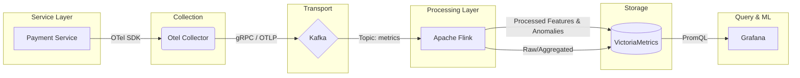

# Architecture: Anomaly Detection on Payment Service

## Use Case Overview
The goal is to detect anomalies (e.g., sudden spikes in failure rates or unusual latency patterns) in a critical payment service in real-time. This allows the operations team to react quickly to potential payment gateway failures or internal bottlenecks.

## End-to-End Data Layer Architecture

## Component Tool Choices
1. **Service (Instrumentation): OpenTelemetry (OTel) SDK**
   - **Reasoning:** Standardized, vendor-agnostic instrumentation. We will instrument the payment service to emit metrics (transaction latency, error counts).
2. **Collection: OpenTelemetry Collector**
   - **Reasoning:** Receives OTLP data, batches it, and exports it. Provides a unified agent deployment for metrics, logs, and traces.
3. **Transport: Apache Kafka**
   - **Reasoning:** Acts as a high-throughput, durable buffer. Decouples the ingestion from the processing layer, preventing data loss during processing spikes or downtime.
4. **Processing: Apache Flink**
   - **Reasoning:** Powerful stateful stream processing engine. Ideal for computing real-time rolling means, standard deviations, and applying threshold-based or ML-based anomaly detection algorithms on streaming data.
5. **Storage: VictoriaMetrics**
   - **Reasoning:** Highly cost-effective and scalable Time-Series Database (TSDB). Compatible with PromQL, offering better performance and lower resource usage compared to standard Prometheus or InfluxDB at a large scale.
6. **Query/ML (Visualization): Grafana**
   - **Reasoning:** Industry standard for observability dashboards. Can query VictoriaMetrics natively and set up alerts based on the anomaly features computed by Flink.
