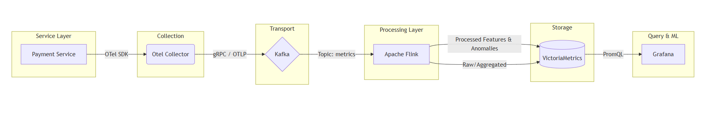

# Phase 4 Submission

## 1. Architecture Diagram

Figure 1: End-to-end AIOps architecture for anomaly detection on a payment service.

---

## 2. Cost Estimation Results

| Tier | Self-Hosted Compute | Self-Hosted Storage | Self-Hosted Network | Total Self-Hosted | Total Datadog |
|--------|--------:|--------:|--------:|--------:|--------:|
| Small | $400.00 | $34.50 | $30.00 | $464.50 | $1,070.00 |
| Medium | $3,200.00 | $345.00 | $300.00 | $3,845.00 | $10,700.00 |
| Large | $25,600.00 | $3,450.00 | $3,000.00 | $32,050.00 | $107,000.00 |

### Build vs Buy Comparison

| Tier | Monthly Savings Using Self-Hosted |
|--------|--------:|
| Small | $605.50 |
| Medium | $6,855.00 |
| Large | $74,950.00 |

Observations:

- Self-hosted infrastructure is cheaper at all scales.
- The cost gap becomes larger as system scale increases.
- Datadog reduces operational burden but introduces significant recurring subscription costs.

---

## 3. ADR Summary

### Decision

Use **VictoriaMetrics** as the primary time-series database for metric storage instead of Prometheus Federation, Elasticsearch, or Datadog SaaS.

### Reasoning

- Lower infrastructure cost at medium and large scale.
- Lower CPU, memory, and storage requirements.
- Compatible with Prometheus and Grafana.
- Supports high-ingestion workloads required for AIOps anomaly detection.

### Trade-Offs

**Benefits**

- Lower storage and compute costs.
- Simpler architecture than Prometheus Federation.
- Good scalability for millions of metric samples per second.

**Drawbacks**

- Smaller ecosystem than Prometheus.
- Less operational familiarity within many engineering teams.
- Requires self-hosted operational ownership.

---

## 4. Reflection

If I were hired as a Platform Engineer at a startup operating approximately 50 services after raising a Series A round, I would recommend **Buy first, then Build later**.

At this stage, engineering productivity and speed of execution are more important than minimizing infrastructure cost. A managed observability platform such as Datadog allows the team to gain monitoring, alerting, dashboards, APM, and log management quickly without dedicating engineers to operate Kafka, Flink, VictoriaMetrics, and supporting infrastructure.

Although the self-hosted solution is cheaper according to the cost model, it introduces operational complexity and requires ongoing maintenance. A Series A startup typically has a small platform team and should focus engineering resources on product development rather than observability infrastructure.

As the company grows toward hundreds of services and observability costs become a significant portion of the engineering budget, I would reevaluate the decision and consider migrating to a self-hosted platform based on OpenTelemetry, Kafka, Flink, VictoriaMetrics, and Grafana. At larger scale, the infrastructure cost savings can justify the additional operational overhead.

Therefore, my recommendation would be:

- **Short term (10–100 services): Buy (Datadog)**
- **Long term (100+ services, high telemetry volume): Build (Self-Hosted AIOps Platform)**

This approach optimizes both engineering velocity and long-term cost efficiency.